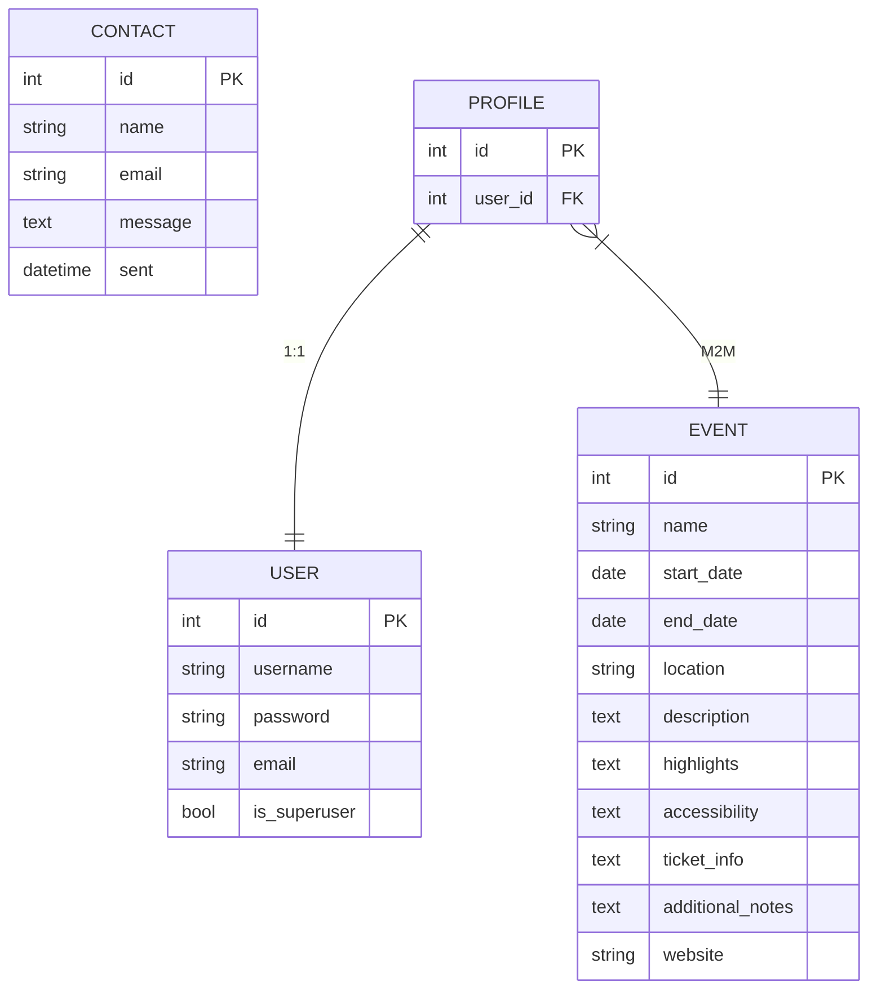

Welcome - this is the Code Institute student template for Gitpod. We have preinstalled all of the tools you need to get started. It's perfectly ok to use this template as the basis for your project submissions.

You can safely delete this README.md file or change it for your own project. Please do read it at least once, though! It contains some important information about Gitpod and the extensions we use. Some of this information has been updated since the video content was created. The last update to this file was: **June 18, 2024**

## Gitpod Reminders

To run a frontend (HTML, CSS, Javascript only) application in Gitpod, in the terminal, type:

`python3 -m http.server`

A blue button should appear to click: _Make Public_,

Another blue button should appear to click: _Open Browser_.

To run a backend Python file, type `python3 app.py` if your Python file is named `app.py`, of course.

A blue button should appear to click: _Make Public_,

Another blue button should appear to click: _Open Browser_.

By Default, Gitpod gives you superuser security privileges. Therefore, you do not need to use the `sudo` (superuser do) command in the bash terminal in any of the lessons.

To log into the Heroku toolbelt CLI:

1. Log in to your Heroku account and go to *Account Settings* in the menu under your avatar.
2. Scroll down to the *API Key* and click *Reveal*
3. Copy the key
4. In Gitpod, from the terminal, run `heroku_config`
5. Paste in your API key when asked

You can now use the `heroku` CLI program - try running `heroku apps` to confirm it works. This API key is unique and private to you, so do not share it. If you accidentally make it public, you can create a new one with _Regenerate API Key_.

### Connecting your Mongo database

- **Connect to Mongo CLI on a IDE**
- navigate to your MongoDB Clusters Sandbox
- click **"Connect"** button
- select **"Connect with the MongoDB shell"**
- select **"I have the mongo shell installed"**
- choose **mongosh (2.0 or later)** for : **"Select your mongo shell version"**
- choose option: **"Run your connection string in your command line"**
- in the terminal, paste the copied code `mongo "mongodb+srv://<CLUSTER-NAME>.mongodb.net/<DBname>" --apiVersion 1 --username <USERNAME>`
  - replace all `<angle-bracket>` keys with your own data
- enter password _(will not echo **\*\*\*\*** on screen)_

------

## Release History

We continually tweak and adjust this template to help give you the best experience. Here is the version history:

**June 18, 2024,** Add Mongo back into template

**June 14, 2024,** Temporarily remove Mongo until the key issue is resolved

**May 28 2024:** Fix Mongo and Links installs

**April 26 2024:** Update node version to 16

**September 20 2023:** Update Python version to 3.9.17.

**September 1 2021:** Remove `PGHOSTADDR` environment variable.

**July 19 2021:** Remove `font_fix` script now that the terminal font issue is fixed.

**July 2 2021:** Remove extensions that are not available in Open VSX.

**June 30 2021:** Combined the P4 and P5 templates into one file, added the uptime script. See the FAQ at the end of this file.

**June 10 2021:** Added: `font_fix` script and alias to fix the Terminal font issue

**May 10 2021:** Added `heroku_config` script to allow Heroku API key to be stored as an environment variable.

**April 7 2021:** Upgraded the template for VS Code instead of Theia.

**October 21 2020:** Versions of the HTMLHint, Prettier, Bootstrap4 CDN and Auto Close extensions updated. The Python extension needs to stay the same version for now.

**October 08 2020:** Additional large Gitpod files (`core.mongo*` and `core.python*`) are now hidden in the Explorer, and have been added to the `.gitignore` by default.

**September 22 2020:** Gitpod occasionally creates large `core.Microsoft` files. These are now hidden in the Explorer. A `.gitignore` file has been created to make sure these files will not be committed, along with other common files.

**April 16 2020:** The template now automatically installs MySQL instead of relying on the Gitpod MySQL image. The message about a Python linter not being installed has been dealt with, and the set-up files are now hidden in the Gitpod file explorer.

**April 13 2020:** Added the _Prettier_ code beautifier extension instead of the code formatter built-in to Gitpod.

**February 2020:** The initialisation files now _do not_ auto-delete. They will remain in your project. You can safely ignore them. They just make sure that your workspace is configured correctly each time you open it. It will also prevent the Gitpod configuration popup from appearing.

**December 2019:** Added Eventyret's Bootstrap 4 extension. Type `!bscdn` in a HTML file to add the Bootstrap boilerplate. Check out the <a href="https://github.com/Eventyret/vscode-bcdn" target="_blank">README.md file at the official repo</a> for more options.

------

## FAQ about the uptime script

**Why have you added this script?**

It will help us to calculate how many running workspaces there are at any one time, which greatly helps us with cost and capacity planning. It will help us decide on the future direction of our cloud-based IDE strategy.

**How will this affect me?**

For everyday usage of Gitpod, it doesn’t have any effect at all. The script only captures the following data:

- An ID that is randomly generated each time the workspace is started.
- The current date and time
- The workspace status of “started” or “running”, which is sent every 5 minutes.

It is not possible for us or anyone else to trace the random ID back to an individual, and no personal data is being captured. It will not slow down the workspace or affect your work.

**So….?**

We want to tell you this so that we are being completely transparent about the data we collect and what we do with it.

**Can I opt out?**

Yes, you can. Since no personally identifiable information is being captured, we'd appreciate it if you let the script run; however if you are unhappy with the idea, simply run the following commands from the terminal window after creating the workspace, and this will remove the uptime script:

```
pkill uptime.sh
rm .vscode/uptime.sh
```

**Anything more?**

Yes! We'd strongly encourage you to look at the source code of the `uptime.sh` file so that you know what it's doing. As future software developers, it will be great practice to see how these shell scripts work.

---

Happy coding!

Mikael testing pushing from new branch
Alan testing pushing from new branch
Vasilika testing
Trev STILL catching up


# Chess Champions

## Introduction

Chess Champions is a website where the user can play a game of chess the way they want against a friend or a computer of varying levels of difficulty. The aim of the site is to entertain the user with a game that is over 1500 years old.

The website is deployed to Github Pages and can be found here: <https://shanebyrne0963.github.io/chess-champions/>


## UI/UX Design

### Color Scheme

- The website has a simple and uniform color scheme, with all text colored white displayed on a brown shaded background
- The brown color is designed to resemble the outside of a chessboard, and gives the website a wood-like asthetic
- Some areas of the website have different shades of brown to add color diversity to the page

### Typography

- The website uses a single font, Roboto Slab, for its headings and normal text
- The use of a single font is to maintain font style consistency across the site
- This font was used because it is an easy to read serif font, with a style that represents the old-fashioned nature of the game well

### Wireframes

- For desktop screen sizes:
    - index.html
        - 
    - game.html
        - 
- For tablet screen sizes:
    - index.html structure remains the same as on desktop
    - game.html
        - 
- For mobile screen sizes:
    - index.html
        - 
    - game.html
        - 

## Features

### Content

- **Game Settings Page**
    - The game settings page is the first page the user is presented with, and provides a wide range of settings for them to customize the game to their liking
    - The user can change the following:
        - Types of players playing the game (Player vs. Player, Player vs. Computer, Computer vs. Computer)
        - Each of the player names (Up to 2)
        - Which side the two different colors will start on
        - The color of the player (Player vs. Computer only)
        - An optional time limit with a minimum time of 30 seconds and a maximum time of 10 hours (Player vs. Player only)
        - The difficulty of the computer, with a range from 0 (easy) to 100 (hard)
        - If a pawn moving to the other side of the board can be promoted to any piece or if they can only bring back pieces removed from the board
        - If the castling move is allowed in the game
        - If the en passant move is allowed in the game
    - These settings are stored in localStorage so they will be remembered when the user returns to the site

- **Game Page**
    - On entering the game page, the game immediately starts, following the rules you would expect in a normal game of chess:
    - *Game Rules* ([Click here to get a more in-depth description](https://en.wikipedia.org/wiki/Rules_of_chess))
        - There are 6 different pieces present on the board: The pawn, knight, bishop, rook, queen and king, each with a different set of moves
        - Both players start with 8 pawns, 2 knights, 2 bishops, 2 rooks, 1 queen and 1 king
        - 
        - The aim of the game is to checkmate the opponent's king, leaving them with no other moves that will result in the king surviving
    - *Advanced Moves*
        - The game has support for the lesser known advanced moves ["Castling"](https://en.wikipedia.org/wiki/Castling) and ["En passant"](https://en.wikipedia.org/wiki/En_passant)
        - These moves are not known by everyone, and there is a chance the user may wish to play the game without these moves, which is why there are options to disable them
    - *Pawn Promotion*
        - If a pawn moves to the end of the board where its enemy started, it will be promoted to any piece other than a pawn or a king
        - When playing chess on a real board, players are limited to taking one of their pieces that was removed from the board. Some users may be accustomed to this, so there is an option to play the game with either of these rules
        - When this event happens to the user, a banner will appear over the board, giving the user clear instructions on how to promote their piece
    - *Check*
        - Check is called when a player's king is under threat if being attacked by an enemy piece on their turn
        - The user cannot make any moves that will not result in this attack being prevented
    - *Checkmate*
        - Checkmate is when a player's king is checked, and there are no other moves they can take to prevent this check
        - When this happens, the game will end, displaying a banner over the board announcing the winner of the game
        - The user can then click on one of the game options to start the game over or return to the game settings page
    - *Stalemate*
        - Stalemate is when a player has no moves to make that will not result in checking their king, but the king is not in check
        - When this happens, the game will end, displaying a banner over the board announcing the stalemate and that the game is a draw
    - *Time Limit*
        - If the game involves two users playing the game against each other, they have an option to include a time limit
        - Each player has their own time limit, which only counts down when it is their turn
        - The timer does not reset every turn
        - If the time counts down to 0, the game will end, and a banner will appear announcing the other player as the winner
        - This option is not available when there is a computer playing the game, because the computer only takes 1 second to make a move, making this timer redundant
    - *Chess Bot*
        - The user has an option to play against the computer, or watch 2 computers play against each other
        - If this option is selected, on the computer's turn, the user will not be able to select or move any of the pieces and one piece will automatically move, moving on to the next turn
        - The outcome of this automatic move depends on the difficulty, a setting the user can change in the game settings page
        - This difficulty is a number with a range from 0 to 100
        - At 0, the computer picks a move at random, taking nothing into consideration
        - At 100, the computer carefully evaluates the board and takes many factors into consideration:
            - If a move is unsafe for the chess piece, this move will be less likely to happen
            - If the move will leave their king exposed, this move will be less likely to happen
            - If an enemy piece can be eliminated, this move will be more likely to happen
            - If the move will surround the enemy king, this move will be more likely to happen
        - In between 0 and 100, thre will be a chance for these parameters into consideration when making the move. The higher the difficulty, the more likely they will be considered

### User Interface

- **Game Settings Page**
    - Upon entering the website, the user is greeted with an assortment of options that lets them customize their game experience.
    - The first setting is a select input requesting the type of players that will play the game. There are 3 different options:
        - Player versus Player
        - Player versus Computer
        - Computer versus Computer
    - 
    - This select input will change the rest of the inputs depending on what is selected. This is done so that settings that are only relevant to the type of players are shown to the user.
    - 
    - Below the dynamic settings There is a drop-down menu for advanced moves. These are hidden by default to prevent too much information being displayed on the screen on page load.
    - 
    - Centered at the bottom of the settings element, there is an anchor element that takes the user to the game, applying all the settings that have been inputted
    - If the user selected "Computer vs. Computer", the text for the anchor will change from "Play Game!" to "Watch Game!" as the user will not be interacting with the game on this setting
    - 
    - The game settings page gives the user a lot of control over how their game is played

- **Game Page**
    
    - The game page is made up of several UI elements:
        - The chess board
        - The player turn heading
        - 2 player user interfaces
        - An announcements section
        - A game options section
        - A banner over the chess board
    - 
    - *Chess Board:*
        - This is where the main gameplay happens
        - The board is made up of an 8x8 grid of tiles
        - The user can interact with their pieces to select them when it is their turn, and can click on any tile the selected piece can move to
        - The possible moves are represented by icons that appear over the tile. There are different icons for different moves
    - 
    - *Player Turn Heading*
        - Notifies the user which player is currently taking their turn
        - Always situated on the top-left corner of the screen, making it more likely for the user to notice it
    - 
    - *Player User Interfaces*
        - Underneath the player turn heading are 2 player user interfaces side by side. For mobile screens they appear under the announcement
        - At the top of this UI, the player's name and their color represented by the king piece to the right of it is displayed
        - In the middle, there is an array of icons for each piece that player has eliminated
        - If a player's pawn reaches the other side of the board and has to pick an eliminated piece to promote to, the icons that the player can revive will begin to flash. This is done to draw attention to the user so they know what to click on
        - At the bottom of the UI, there is a clock icon with the amount of time the user has to make the move remaining. This feature is only available in player vs player, and if the user requested a time limit
        - If the UI belongs to the player that is taking their turn, the element will have a white outline, making it clearer whose turn it is
    - 
    - *Announcements*
        - Announcements appear under the player user interfaces for desktop and under the chess board for tablets and mobile phones
        - Each time an event happens, a new notification will appear at the bottom of the element, notifying the user of the event
        - The announcements will let the user know about a pawn elimination, check, checkmate or timeout
        - Any new announcements will be gold in color until the next turn, differentiating it from announcements that are less relevant
        - This part of the user interface is important because it informs the user about what is happening in the game, in case there is something they missed or did not notice
    - 
    - *Game Options*
        - Situated at the bottom of the user interface, this section consists of 2 buttons
        - The first button resets the game, clearing any changes and setting up the chess board. This button does not take the user to another page
        - The second button is an anchor that returns the user to the game settings page
        - This main purpose of this part of the UI is to allow the user to make changes to the game settings if they are not happy with them, or start the game over if desired
    - 
    - *Banner*
        - The banner displays a heading, subheading and sometimes a grid of icons over the chess board and is only visible when the game has paused or ended
        - This only happens when a player is promoting a pawn, on checkmate or if a player runs out of time
        - On pawn promotion, if the user has chosen to promote the pawn to any piece, 4 icons, the knight, the bishop, the rook and the queen, will appear under the text
        - The color of these icons depends on the color of the player that has activated the banner
        - On game end, the banner will disappear after 5 seconds to allow the user to see the board again, if they desire
        - Because the banner appears over the chess board, it is a very effective way of informing the player of the steps they need to take to continue the game, without leaving the user wondering what to do next
    - 

## Testing

### Bugs
- **Bug #1 (28/6/23) Chess pieces not rendering on board**
    - Expected result: Chess pieces to be visible on the board
	- Solution: Incorrect directory to locate the images. Used url("assets/images/chess-pieces/black-pawn.png"); in css file.
	Should have used url("../images/chess-pieces/black-pawn.png");

- **Bug #2 (29/6/23) Applied an onclick function to the document to deselect all tiles when the user clicks on something that's**
	not their chess piece. However it deselects everything even when a piece is clicked
	- Expected result: I wanted the document's onclick function to run first, deselecting everything first and then selecting
	the clicked tile, but JavaScript does not work that way
	- Solution: Approach the deselection in a different way: add onclick listeners for all tiles instead of just the
	player tiles, as well as adding a separate onclick listener for the UI div. This allows the deselect function to be called
	when the user clicks on certain points rather than call it every time the user clicks on the screen

- **Bug #3 (30/6/23) List of possible moves for AI is not added to the designated array**
	- Expected result: All of the possible moves should be added to the array
	- Solution: I used square brackets [] instead of parentheses () for the array.push() method

- **Bug #4 (1/7/23) Tile evaluation stops at empty space**
	- Expected result: Tile evaluation loop should stop when it encounters a piece
	- Solution: The loop ends when it encounters a piece with the same color. However it is comparing the color with the
	blank tile that's being evaluated, rather than the piece that's evaluating the tile. To fix this, add a second argument
	to tile.evaluate containing the information of the evaluating tile

- **Bug #5 (1/7/23) Pawn threats are sometimes ignored and AI pieces move into positions where they can be destroyed**
	- Expected result: The AI should take all pawns into consideration when making a move
	- Solution: The AI only checked the 'pawn' piece name. This check wouldn't count for 'pawnNew' pieces that haven't made
	a move yet. To fix this, instead of checking if the piece name equals 'pawn', check if the string.includes('pawn')

- **Bug #6 (1/7/23) Sometimes the AI moves pieces into dangerous positions**
	- Expected result: The AI shouldn't move into a vulnerable position unless it is guarded by another piece
	- Solution: The piece was including itself before the move as a guard. To fix this just ignore the tile if it's the
	same as the original position

- **Bug #7 (2/7/23) Knight is putting itself in a vulnerable position to attack a Pawn**
	- Expected result: The AI shouldn't move into a vulnerable position unless it is guarded by another piece
	- Solution: The Knight was eliminating a Pawn and putting the king in check. Those scores (eliminating Pawn: 100 and
	targeting King: 200) were summing up to be equal to the Knight's value of 300, so it thought sacrificing itself for
	a check and a Pawn kill was worth it. To fix this, bring down the value of the King from 2000 to 1500
	-> This wasn't the best solution, because if there are a lot of targets within that tile the total score will go above
		300 anyway. A better solution would be for the AI to only take targets into consideration if the tile is safe

- **Bug #8 (4/7/23) When the computer is to make the first move, it doesn't move**
	- Expected result: The ai should run through the function as normal when first
	- Solution: The calculations script file is loaded last, so the game script is calling the calculations script before
	it is even loaded. Move the calculations file above the game file in the html to fix

- **Bug #9 (4/7/23) Some tiles have the 'clickable' class in their class list multiple times**
	- Expected result: Every element in the entire DOM should only have the 'clickable' at most once
	- Solution: The 'possible-move' tiles were not removing their clickable class when deleted. Add code to remove the class
	in deselectAll to fix this

- **Bug #10 (4/7/23) Pieces cannot be clicked on once they make a move**
    - Expected result: Any friendly piece can move once it is the player's turn
    - Solution: the deselectAll fix above removes the class after the piece makes a move. Since I moved the nextTurn function into the tile.move function, deselectAll is called after the ai makes a move. To fix this, call deselectAll before tile.move

- **Bug #11 (4/7/23) When a player makes a move, only some pieces have their interaction taken away**
	- Expected result: When the player makes a move, all interaction should be taken away until it is their turn again or
	they have selected a piece from the graveyard to revive
	- Solution: To deselect, I was looping through an array containing all the elements with the 'clickable' class, then
	removing the ones that also have the 'tile' class. However, when I removed the 'clickable' class, it was also getting
	removed from the array, so the loop was skipping over some elements. To fix this, only increment through the loop if
	the element with the 'clickable' class does NOT also have the 'tile' class

- **Bug #12 (5/7/23) Some valid moves are not permitted when preventing a check**
	- Expected result: Any valid move should be able to be taken
	- Solution: The variable for checking if a move is valid is set outside the loop, and does not reset each iteration
	like it should. That means that once an invalid tile is found, then all other tiles will be declared as invalid for that
	move. To fix, move the variable declaration inside the loop

- **Bug #13 (6/7/23) Animation piece not setting the size or position**
	- Expected result: The animation should have the same size and position as the starting tile
	- Solution: Include "px" at the end of the css style strings when setting them

- **Bug #14 (11/7/23) Pawns are seen as unable to attack in the ai tile evaluation**
	- Expected result: Pawns should be seen as threats by pieces in their sights, and pawns should be able to attack other pieces
	- Solution: The pawn can only attack one space diagonal to them. The loop gets this space by moving in a diagonal direction and
	checking the first tile in the loop. However, the loop starts at the tile itself, instead of the first tile in the diagonal
	directions. To fix this, add the vector to the coordinates before checking if a pawn is there

- **Bug #15 (12/7/23) Checkmate is called even though there are pieces that can prevent it**
	- Expected result: If there are moves the player can take, the game should still continue
	- Solution: evaluateTileWithMove was not working because I was setting the parent node of the chess piece to move it to
	another tile. tile.appendChild seemed to fix this problem

- **Bug #16 (12/7/23) Multiple pieces moving at the same time when the game is restarted**
	- Expected result: On game restart, the animations should play one by one
	- Solution: Clear the timeout for the ai waiting to make a move when the game resets

- **Bug #17 (16/7/23) Castling move turns into a vector move after first use**
	- Expected result: The piece moves should never change
	- Solution: When passing the move into evaluateTileVector, I was changing the rule from 'first-castle' to 'vector', thinking
	that passing an array into a function creates a copy of an array. However, instead it creates a reference to that array. To fix,
	create a new array inside the function and assign the move elements to it, except the ones I want to change

- **Bug #18 (17/7/23) Pawns will put themselves in vulnerable positions to attack other pawns**
	- Expected Result: Pawns should be more cautious of their moves
	- Solution: If moving to a tile is considered to be a bad move, then the score was being subtracted based on where the pawn was before
	the move, instead of after. This may have caused insufficient point reduction to deter the pawn from moving there. To fix,
	subtract the score based on the tile the pawn will move to

- **Bug #19 (21/7/23) Sometimes enemy pieces can be clicked on and moved by the player**
	- Expected result: The player should only be able to interact with their own pieces
	- Solution:
        - When the player clicks on an empty tile the piece cannot move to, all tiles will be deselected.
        - This involves removing the interaction from all empty tiles, but leaving the interaction on pieces so the player can click on them again.
        - However, the logic did not consider if the piece with the interaction was an enemy piece, which occurs when a piece can attack an enemy.
        - This meant that when the deselect tile function was called, the enemy that could be attacked kept it's interaction and was treated like a player piece when clicked on afterwards.
        - To fix, remove the interaction from the piece if the its color does not match the current turn's color

- **Bug #20 (23/7/23) Sometimes player pieces cannot be selected on the player turn**
	- Expected result: When it is the player's turn, they should be able to select any of their pieces
	- Solution: If the player clicks on the button to restart the game while a piece is selected, the possible move elements aren't
	properly deleted, and there is no attempt to delete them on game restart. To fix this, deselect all tiles when the game starts/restarts

- **Bug #21 (23/7/23) On very rare occasions, the game stops before checkmate or timeout**
	- Expected result: The game should continue until checkmate or a player's time runs out
	- Solution: What happened was a stalemate, i.e. when there is no legal moves for the player to take but they are not in check. The
	code did not have an if statement for this happening, so put one in to fix it.

### Manual Testing

- **Form Inputs**
    - Any player name input, checkbox or number input displayed on the menu settings page is required and the form will not submit unless they are filled out
    - If the player names are more than 10 characters long, an alert will appear telling the user the name has to be smaller and remove the value
    - Number inputs have a default value that they will be set to if the user enters an invalid number
    - If the user enters an invalid time, for example, 70 minutes, it will convert that time to 1 hour and 10 minutes, and will add 1 to the hour input
    - The user cannot play with a time limit smaller than 30 seconds or larger than 10 hours
    - If the time limit is not enabled, the user cannot change the values of the time limit
    - The enter key has been manually disabled to prevent the user submitting the form prematurely by pressing enter
- **User Interaction**
    - The user cannot select pieces that do not belong to them, or cannot select any piece at all if it is not their turn
    - The user cannot select any pieces while a banner is displaying over the board, or if the game has ended
    - The user cannot make any moves that will result in checking their own king
    - If the user has selected the option to promote pawns from eliminated pieces, their pawns cannot move to the other side of the board unless they have a piece to bring back
    - Under the above conditions, a pawn cannot put a king in check if the king is at their end of the board
    - If a pawn cannot attack a king this way, but is in a position to attack, the other player cannot eliminate any pieces higher than a pawn to prevent this attack
    - If Javascript is disabled on the browser, the user will be notified about this on the page
- **Anchors and Buttons**
    - Every link, internal and external, has been clicked on every page and each one works as intended.
    - All external pages are opened in a new tab.
- **Media Queries**
    - Every page has been tested for responsive screen width, with nothing overflowing or overlapping above a screen width of 320px.
- **Other Browsers**
    - I have tested this site on Google Chrome, Microsoft Edge and Mozilla Firefox and confirmed the site works as intended on those platforms

### Validator Testing

- All HTML files have been passed through the W3C Markup Validator and produced no issues


- All CSS files have been passed through the Jigsaw W3C Validator and produced no issues


- All Javascript files have been passed through the JsHint Validator and produced no warnings


- All background colors have been tested against the website's white font for contrast and each one passed


- Each page has been tested using the Lighthouse developer tool and produced high results


### Unfixed Bugs

No unfixed bugs

## Deployment and Local Development

### Deploy on Github Pages

- The site has been successfully deployed to GitHub Pages. The steps to deploy are as follows:
  - In the GitHub repository, navigate to the Settings tab.
  - In the Pages tab, from the source drop-down menu, select "Deploy from a branch".
  - Under the Branch heading, ensure the first drop-down menu has "main" selected and click the "Save" button to the right of it.
  - Wait a few minutes and refresh the page. The link will appear under the GitHub Pages heading.
- The live site can be visited [here](https://shanebyrne0963.github.io/chess-champions/).

### Cloning Repositories

- The site was cloned onto my desktop. The steps to clone are as follows:
  - In the GitHub repository, click on the green button that says "Code". A drop-down menu will appear.
  - In the "Local" tab of the drop-down, there will be a link under the "HTTPS" section. Click the copy button to the right of the link.
  - In the search bar of your PC desktop, search for terminal and open.
  - Type the following command: `git clone https://github.com/ShaneByrne0963/chess-champions.git`.
  - The site will be cloned to your desktop.

### Forking Repositories

- The site was created using a forked repository created by Code Institute. This repository can be found [here](https://github.com/Code-Institute-Org/ci-full-template).
- The steps to fork are as follows:
  - Navigate to the page of the repository you wish to fork.
  - Click on the green button that says "Use this template". A drop-down will appear underneath, and select "create a new repository"
  - Enter a repository name where specified.
  - Ensure the site is set to public
  - Click "Create repository from template". Codeanywhere will begin to build a new project from that template.

## Credits

### Content

- [Local storage tutorial](https://developer.mozilla.org/en-US/docs/Web/API/Window/localStorage)
- [Session storage tutorial](https://developer.mozilla.org/en-US/docs/Web/API/Window/sessionStorage)
- [Animate element movement](https://www.w3schools.com/howto/howto_js_animate.asp)
- [Getting the position of an element](https://stackoverflow.com/questions/442404/retrieve-the-position-x-y-of-an-html-element)
- [Window resize event](https://stackoverflow.com/questions/641857/javascript-window-resize-event)
- [CSS aspect-ratio attribute](https://developer.mozilla.org/en-US/docs/Web/CSS/aspect-ratio)
- [CSS calc() function](//developer.mozilla.org/en-US/docs/Web/CSS/calc)
- [CSS repeat() function](//css-tricks.com/snippets/css/complete-guide-grid/)
- [Change properties of range input](https://nikitahl.com/style-range-input-css#:~:text=One%20simple%20way%20to%20customize,of%20the%20track%20and%20thumb.)
- [Prevent the enter key from submitting a form](https://stackdiary.com/tutorials/prevent-form-submission-on-pressing-enter-with-javascript/)

### Media

- [Chess Piece Images](https://commons.wikimedia.org/wiki/Category:SVG_chess_pieces)


# [UNITED EVENTS 🏳️‍🌈📅](https://united-events-a9a097150c85.herokuapp.com)

Discover the best Pride events around the UK! Your ultimate guide to LGBTQ+ festivals, parades, and celebrations. Join the fun, embrace diversity, and show your Pride!

[](https://github.com/hannahro15/July24Hackathon-United-Events/commits/main)
[](https://github.com/hannahro15/July24Hackathon-United-Events/commits/main)


[](https://github.com/hannahro15/July24Hackathon-United-Events)
[](https://github.com/hannahro15/July24Hackathon-United-Events/commits/main)


## UX

### Colour Scheme

We've used CSS for the colours to simplify switching theme colours quickly (if necessary).

```css
:root {
    --black: 0, 0, 0; /* #000000 */
    --white: 255, 255, 255; /* #FFFFFF */
    --offwhite: 250, 250, 250; /* #FAFAFA */

    --united-red: 255, 0, 0; /* #FF0000 */
    --united-orange: 255, 127, 0; /* #FF7F00 */
    --united-yellow: 255, 255, 0; /* #FFFF00 */
    --united-green: 0, 255, 0; /* #00FF00 */
    --united-blue: 0, 0, 255; /* #0000FF */
    --united-indigo: 75, 0, 130; /* #4B0082 */
    --united-violet: 139, 0, 255; /* #8B00FF */

    --united-grey-light: 125, 125, 125; /* #7D7D7D */
    --united-grey-dark: 58, 58, 58; /* #3A3A3A */

    --united-primary: 241, 26, 123; /* #F11A7B */
    --united-secondary: 152, 33, 118; /* #982176 */
    --united-tertiary: 0, 101, 119;  /* #006577 */
    --united-quaternary: 255, 201, 83; /* #FFC953 */
}
```

We've used [coolors.co](https://coolors.co/f11a7b-982176-006577-ffc953-000000-fafafa) to generate our colour palette.


### Typography

- [Lato](https://fonts.google.com/specimen/Lato) was used for all other secondary text.

- [Font Awesome](https://fontawesome.com) icons were used throughout the site, such as the social media icons in the footer.

## User Stories

### Home Page
- As a user, it should be clear what the website is about and its purpose so I know how to navigate it.
- As a user, the home page should provide a link to the page with the calendar with the events in.

### Registration and Login Form (on two separate pages)

#### New user

- As a new user I should be able to navigate to registration page from the home page
- As a new user, when I visit the application’s homepage, I should be able to see an option to register for a new account.
- As a new user, when on the registration page, I should be able to fill out the form with my name, email, and password.
- As a new user, when I have filled out the registration form I should be able to submit the form easily and the system should validate the form fields such as checking for valid email format and password strength etc.
- When the new user submits the form, the system should create a new user account in the database.
- When a new user's account has been created and is successful, the user should see a confirmation message that their account has been created.
- When the new user's account is successful and see's the confirmation message, they should be automatically logged in to their new account each time they log in.
- As a new user when they create their account the system should send a verification email to their registered email address.
- When a new user has received a verification email, their account should be activated when they click on the link to confirm verification.

#### Registered user

- As a registered user, I should be able to log in to their account so I can view and manage their events.
- As a registered user, when I visit the application’s homepage, I should see an option to log in to my account.
- As a registered user, when I am on the login form and enter my email and password, I should be able to submit the form to log in.
- As a registered user, when they submit the form, the system should validate the email and password fields.
- As a registered user, if the form is valid, the system should check their credentials against the database. If credentials are correct, and when the system authenticates me, then they should be logged in and redirected to their account dashboard.
- As a registered user, if they have entered incorrect credentials and the system fails to authenticate me, then they should see an error message indicating invalid email or password.
- As a registered user, if I forget my password, there should be an option to reset my password by receiving a reset link via email.

By breaking down these user stories into more granular steps, you can ensure that all aspects of the user registration and authentication process are covered and can be implemented systematically.

### Events/Calendar Page

- As a user, I should be able to select events I want and be able to register for them.
- As a user, I should be able to navigate around the events page to find events I need so I can view them.
- As a user, I should be able to scroll through the calendar on the events page and click on each event under each date to register for the event.
- As an admin, they should be able to create, update, add, and remove events from the calendar.

### Contact Us Page

- As a user I should be able to fill out the contact us form and to be able to submit it easily without any issues.

### Team Page

- As a user, I should be able to see details of the team members on the team members page so I see their github profile links, linkedIn urls, and how they contributed to the project.

### General 

- As a user, I expect all the links to be working as expected across the website so I don't come across any broken links.
- As a user, I expect the styling to be consistent across the pages so that I everything looks appealing visually.
- As a user, I expect the website to be responsive on all different screen sizes so I can view all content and information easily.
- As an admin, I should be able to update an Event, so that I can maintain a clean database, clean any mistakes, or remove events no longer needed.
- As an admin, I should be able to delete an Event, so that I can maintain a clean database, clean any mistakes, or remove events no longer needed.

## Wireframes

To follow best practice, wireframes were developed for mobile, tablet, and desktop sizes.
We've used [Balsamiq](https://balsamiq.com/wireframes) to design our site wireframes.

| | Register | Login | Home | Events Calendar |
| --- | --- | --- | --- | --- |
| mobile |  |  |  |  |
| tablet |   |  |  |  |
| desktop |  |  |  |  |


## Features

### Existing Features

- **HOME PAGE**

    - This page introduces us to the website and its purpose. It also states what the whole website is about and its mission.


- **EVENTS PAGE**

    - This events page takes the form on the calendar. Users can select events and add it to their profile if they are interested. When clicking on an event there is a pop-up which gives information on the event and a button at the bottom that users can click on to say if they are interested or not and a close button too. 


- **CONTACT PAGE**

    - The contact form for users to submit messages about anything related to LGBTQIA+ events on the website or queries in general. The submit button on the page goes directly to the database.


- **ACCOUNT(REGISTER AND LOGIN FORMS) PAGE**

    - There are two separate forms

    *Register*
    

    *Sign-in*
    

- **TEAM PAGE**
    
    - The team page is a page that features members of the team who worked on the project in a form of a grid layout. Each team member card shows their photo, GitHub and LinkedIn URL's and outlines their individual contributions to the group project.


- **NAVBAR**
  


- **FOOTER**


- **USER PROFILE PAGE**

- This page is where a user can add or remove events to their profile.


- **EVENTS ADMIN PAGE**

- This is where the admins can add, update, or delete events, to keep the calendar *current* & relevant.

    - Manage Events
    

    - Add Event
    

    - Edit Event
    

    - Delete Event
    


- **ERROR PAGES**

    - We have included error handling for the following pages:

    | error | screenshot |
    | ---- | --- |
    | 400 |  |
    | 403 |  |
    | 404 |  |
    | 500 |  |

### Future Features

- Add in a functionality on the events page so that users can filter events by location or by type of event.
    - This can ensure that users can select and filter what events they are interested or not interested in based on their own requirements.
- Add more styling to the register and login page 
   
## Tools & Technologies Used

- [](https://git-scm.com) used for version control. (`git add`, `git commit`, `git push`)
- [](https://github.com) used for secure online code storage.
- [](https://gitpod.io) used as a cloud-based IDE for development.
- [](https://code.visualstudio.com) used as a local IDE for development.
- [](https://en.wikipedia.org/wiki/HTML) used for the main site content.
- [](https://en.wikipedia.org/wiki/CSS) used for the main site design and layout.
- [](https://www.javascript.com) used for user interaction on the site.
- [](https://jquery.com) used for user interaction on the site.
- [](https://www.python.org) used as the back-end programming language.
- [](https://www.heroku.com) used for hosting the deployed back-end site.
- [](https://getbootstrap.com) used as the front-end CSS framework for modern responsiveness and pre-built components.
- [](https://www.djangoproject.com) used as the Python framework for the site.
- [](https://www.postgresql.org) used as the relational database management.
- [](https://dbs.ci-dbs.net) used as the Postgres database from Code Institute.
- [](https://whitenoise.readthedocs.io) used for serving static files with Heroku.
- [](https://balsamiq.com/wireframes) used for creating wireframes.
- [](https://fontawesome.com) used for the icons.
- [](https://chat.openai.com) used to help debug, troubleshoot, and explain things.

## Testing

### Code Validation

#### HTML

We have used the recommended [HTML W3C Validator](https://validator.w3.org) to validate our HTML files.

| Page | W3C URL | Screenshot | Notes |
| --- | --- | --- | --- |
| index | [W3C](https://validator.w3.org/nu/?doc=https://united-events-a9a097150c85.herokuapp.com/) |  | Fixed "section lacks heading" warning |
| events | [W3C](https://validator.w3.org/nu/?doc=https://united-events-a9a097150c85.herokuapp.com/events/) |  | Fixed "section lacks heading" warning |
| contact | [W3C](https://validator.w3.org/nu/?doc=https://united-events-a9a097150c85.herokuapp.com/contact/) |  | ✅ |
| team | [W3C](https://validator.w3.org/nu/?doc=https://united-events-a9a097150c85.herokuapp.com/team/) |  | ✅ |
| profile | N/A |  | Fixed invalid spaces in href error |
| event management | N/A |  | Fixed duplicate ID errors |
| add event | N/A |  | ✅ |
| edit event | N/A |  | ✅ |

#### CSS

We have used the recommended [CSS Jigsaw Validator](https://jigsaw.w3.org/css-validator) to validate our CSS files.

| File | Jigsaw URL | Screenshot | Notes |
| --- | --- | --- | --- |
| styles.css | [Jigsaw](https://jigsaw.w3.org/css-validator/validator?uri=https%3A%2F%2Funited-events-a9a097150c85.herokuapp.com) |  | ✅ |
| events.css | N/A |  | ✅ |
| team.css | N/A |  | ✅ |

#### JAVASCRIPT

We have used the recommended [JShint Validator](https://jshint.com) to validate our JS file.

| File | Screenshot | Notes |
| --- | --- | --- |
| scripts.js |  | Warning: outer-scoped functions |

#### PYTHON

We have used the recommended [PEP8 CI Python Linter](https://pep8ci.herokuapp.com) to validate our Python files.

| File | CI URL | Screenshot | Notes |
| --- | --- | --- | --- |
| contact/admin.py | [PEP8 CI](https://raw.githubusercontent.com/hannahro15/July24Hackathon-United-Events/main/contact/admin.py) |  | ✅ |
| contact/forms.py | [PEP8 CI](https://pep8ci.herokuapp.com/https://raw.githubusercontent.com/hannahro15/July24Hackathon-United-Events/main/contact/forms.py) |  | ✅ |
| contact/models.py | [PEP8 CI](https://pep8ci.herokuapp.com/https://raw.githubusercontent.com/hannahro15/July24Hackathon-United-Events/main/contact/models.py) |  | ✅ |
| contact/urls.py | [PEP8 CI](https://pep8ci.herokuapp.com/https://raw.githubusercontent.com/hannahro15/July24Hackathon-United-Events/main/contact/urls.py) |  | ✅ |
| contact/views.py | [PEP8 CI](https://pep8ci.herokuapp.com/https://raw.githubusercontent.com/hannahro15/July24Hackathon-United-Events/main/contact/views.py) |  | ✅ |
| events/admin.py | [PEP8 CI](https://pep8ci.herokuapp.com/https://raw.githubusercontent.com/hannahro15/July24Hackathon-United-Events/main/events/admin.py) |  | ✅ |
| events/forms.py | [PEP8 CI](https://pep8ci.herokuapp.com/https://raw.githubusercontent.com/hannahro15/July24Hackathon-United-Events/main/events/forms.py) |  | ✅ |
| events/models.py | [PEP8 CI](https://pep8ci.herokuapp.com/https://raw.githubusercontent.com/hannahro15/July24Hackathon-United-Events/main/events/models.py) |  | ✅ |
| events/urls.py | [PEP8 CI](https://pep8ci.herokuapp.com/https://raw.githubusercontent.com/hannahro15/July24Hackathon-United-Events/main/events/urls.py) |  | ✅ |
| events/views.py | [PEP8 CI](https://pep8ci.herokuapp.com/https://raw.githubusercontent.com/hannahro15/July24Hackathon-United-Events/main/events/views.py) |  | ✅ |
| index/urls.py | [PEP8 CI](https://pep8ci.herokuapp.com/https://raw.githubusercontent.com/hannahro15/July24Hackathon-United-Events/main/index/urls.py) |  | ✅ |
| index/views.py | [PEP8 CI](https://pep8ci.herokuapp.com/https://raw.githubusercontent.com/hannahro15/July24Hackathon-United-Events/main/index/views.py) |  | ✅ |
| profiles/admin.py | [PEP8 CI](https://pep8ci.herokuapp.com/https://raw.githubusercontent.com/hannahro15/July24Hackathon-United-Events/main/profiles/admin.py) |  | ✅ |
| profiles/models.py | [PEP8 CI](https://pep8ci.herokuapp.com/https://raw.githubusercontent.com/hannahro15/July24Hackathon-United-Events/main/profiles/models.py) |  | ✅ |
| profiles/urls.py | [PEP8 CI](https://pep8ci.herokuapp.com/https://raw.githubusercontent.com/hannahro15/July24Hackathon-United-Events/main/profiles/urls.py) |  | ✅ |
| profiles/views.py | [PEP8 CI](https://pep8ci.herokuapp.com/https://raw.githubusercontent.com/hannahro15/July24Hackathon-United-Events/main/profiles/views.py) |  | ✅ |
| united/settings.py | [PEP8 CI](https://pep8ci.herokuapp.com/https://raw.githubusercontent.com/hannahro15/July24Hackathon-United-Events/main/united/settings.py) |  | ✅ |
| united/urls.py | [PEP8 CI](https://pep8ci.herokuapp.com/https://raw.githubusercontent.com/hannahro15/July24Hackathon-United-Events/main/united/urls.py) |  | ✅ |
| united/views.py | [PEP8 CI](https://pep8ci.herokuapp.com/https://raw.githubusercontent.com/hannahro15/July24Hackathon-United-Events/main/united/views.py) |  | ✅ |

### Unfixed bugs

- ~~Django security issue with vulnerabilities~~
    - PATCHED: updated `Django==4.2.14`

 

## Database Design

Entity Relationship Diagrams (ERD) help to visualize database architecture before creating models.
Understanding the relationships between different tables can save time later in the project.

Below is our ERD using the [Mermaid](https://mermaid.live/edit#pako:eNqdU8tuwjAQ_BXLZzjQY24VDVJFeQhoT5EiEy9hRWJH9kYUkfx77YaW1oCoaimSMzMez242R55pCTziYJ5Q5EaUiWJuDWfT1eNwxY7dq1-oiKFk8_EZsmRQ5UyJEi5AKAUWZ5TgnVgJ1or8h1YKAsISmAVFHdwmqtvEb_H0XwG8qWOEodRvAwKUDOCTSaEzQahVkFmCzQxWV5gt5tvCPWQDQmSZKxTXWCAdAo4w2wGlqDY6PCUl-ltEkSpNYC8C7mFt8Sv4d5vmi9no-SW-0ygP1RZM6vDROLB4XcaLvzXaW1z92pWwdq-NvDcGa60Lhja1dQXGu92opmn6_abpkkUs4YNokPDfkraTdGPiNZOHidfwHi_BuGulG-vPqhJOW3ChuVdJYXZe1jqdqEkvDyrjEZkaeryu_GScfgQebURhof0A3PfwUg) library.




## Agile Development Process

### GitHub Projects

[GitHub Projects](https://github.com/users/hannahro15/projects/3) served as an Agile tool for this project.
It isn't a specialized tool, but with the right tags and project creation/issue assignments, it can be made to work.

Through it, user stories, issues, and tasks were planned, then tracked on a daily basis using the basic Kanban board.


### GitHub Issues

[GitHub Issues](https://github.com/hannahro15/July24Hackathon-United-Events/issues) served as an another Agile tool.

It also helped with iterations on a daily basis.


- [Open Issues](https://github.com/hannahro15/July24Hackathon-United-Events/issues) [](https://github.com/hannahro15/July24Hackathon-United-Events/issues)

    

- [Closed Issues](https://github.com/hannahro15/July24Hackathon-United-Events/issues?q=is%3Aissue+is%3Aclosed) [](https://github.com/hannahro15/July24Hackathon-United-Events/issues?q=is%3Aissue+is%3Aclosed)

    
    

### MoSCoW Prioritization

We've decomposed our Epics into stories prior to prioritizing and implementing them.
Using this approach, we were able to apply the MoSCow prioritization and labels to our user stories within the Issues tab.

- **Must Have**: guaranteed to be delivered (*max 60% of stories*)
- **Should Have**: adds significant value, but not vital (*the rest ~20% of stories*)
- **Could Have**: has small impact if left out (*20% of stories*)
- **Won't Have**: not a priority for this iteration

## Deployment

The live deployed application can be found deployed on [Heroku](https://united-events-a9a097150c85.herokuapp.com).

### PostgreSQL Database

This project uses a [Code Institute PostgreSQL Database](https://dbs.ci-dbs.net).

To obtain our own Postgres Database from Code Institute, we followed these steps:

- Signed-in to the CI LMS using one of our team member's email address.
- An email was sent to them with our new Postgres Database.

> [!CAUTION]  
> - PostgreSQL databases by Code Institute are only available to CI Students.
> - You must acquire your own PostgreSQL database through some other method
> if you plan to clone/fork this repository.
> - Code Institute students are allowed a maximum of 8 databases.
> - Databases are subject to deletion after 18 months.

### Heroku Deployment

This project uses [Heroku](https://www.heroku.com), a platform as a service (PaaS) that enables developers to build, run, and operate applications entirely in the cloud.

Deployment steps are as follows, after account setup:

- Select **New** in the top-right corner of your Heroku Dashboard, and select **Create new app** from the dropdown menu.
- Your app name must be unique, and then choose a region closest to you (EU or USA), and finally, select **Create App**.
- From the new app **Settings**, click **Reveal Config Vars**, and set your environment variables.

> [!IMPORTANT]  
> This is a sample only; you would replace the values with your own if cloning/forking our repository.

| Key | Value |
| --- | --- |
| `DATABASE_URL` | user's own value |
| `SECRET_KEY` | user's own value |

Heroku needs two additional files in order to deploy properly.

- requirements.txt
- Procfile

You can install this project's **requirements** (where applicable) using:

- `pip3 install -r requirements.txt`

If you have your own packages that have been installed, then the requirements file needs updated using:

- `pip3 freeze --local > requirements.txt`

The **Procfile** can be created with the following command:

- `echo web: gunicorn app_name.wsgi > Procfile`
- *replace **app_name** with the name of your primary Django app name; the folder where settings.py is located*

For Heroku deployment, follow these steps to connect your own GitHub repository to the newly created app:

Either:

- Select **Automatic Deployment** from the Heroku app.

Or:

- In the Terminal/CLI, connect to Heroku using this command: `heroku login -i`
- Set the remote for Heroku: `heroku git:remote -a app_name` (replace *app_name* with your app name)
- After performing the standard Git `add`, `commit`, and `push` to GitHub, you can now type:
	- `git push heroku main`

The project should now be connected and deployed to Heroku!

### Local Deployment

This project can be cloned or forked in order to make a local copy on your own system.

For either method, you will need to install any applicable packages found within the *requirements.txt* file.

- `pip3 install -r requirements.txt`.

You will need to create a new file called `env.py` at the root-level,
and include the same environment variables listed above from the Heroku deployment steps.

> [!IMPORTANT]  
> This is a sample only; you would replace the values with your own if cloning/forking our repository.

Sample `env.py` file:

```python
import os

os.environ.setdefault("DATABASE_URL", "user's own value")
os.environ.setdefault("SECRET_KEY", "user's own value")

# local environment only (do not include these in production/deployment!)
os.environ.setdefault("DEBUG", "True")
```

Once the project is cloned or forked, in order to run it locally, you'll need to follow these steps:

- Start the Django app: `python3 manage.py runserver`
- Stop the app once it's loaded: `CTRL+C` or `⌘+C` (Mac)
- Make any necessary migrations: `python3 manage.py makemigrations`
- Migrate the data to the database: `python3 manage.py migrate`
- Create a superuser: `python3 manage.py createsuperuser`
- Load fixtures (if applicable): `python3 manage.py loaddata file-name.json` (repeat for each file)
- Everything should be ready now, so run the Django app again: `python3 manage.py runserver`

#### Cloning

You can clone the repository by following these steps:

1. Go to the [GitHub repository](https://github.com/hannahro15/July24Hackathon-United-Events) 
2. Locate the Code button above the list of files and click it 
3. Select if you prefer to clone using HTTPS, SSH, or GitHub CLI and click the copy button to copy the URL to your clipboard
4. Open Git Bash or Terminal
5. Change the current working directory to the one where you want the cloned directory
6. In your IDE Terminal, type the following command to clone our repository:
	- `git clone https://github.com/hannahro15/July24Hackathon-United-Events.git`
7. Press Enter to create your local clone.

Alternatively, if using Gitpod, you can click below to create your own workspace using this repository.

[](https://gitpod.io/#https://github.com/hannahro15/July24Hackathon-United-Events)

Please note that in order to directly open the project in Gitpod, you need to have the browser extension installed.
A tutorial on how to do that can be found [here](https://www.gitpod.io/docs/configure/user-settings/browser-extension).

#### Forking

By forking the GitHub Repository, we make a copy of the original repository on our GitHub account to view and/or make changes without affecting the original owner's repository.
You can fork this repository by using the following steps:

1. Log in to GitHub and locate the [GitHub Repository](https://github.com/hannahro15/July24Hackathon-United-Events)
2. At the top of the Repository (not top of page) just above the "Settings" Button on the menu, locate the "Fork" Button.
3. Once clicked, you should now have a copy of the original repository in your own GitHub account!

### Local VS Deployment

There are no major differences between the local version and the deployed version.

## Credits

### Content

| Source | Location | Notes |
| --- | --- | --- |
| [Chris Beams](https://chris.beams.io/posts/git-commit) | version control | "How to Write a Git Commit Message" |
| [WhiteNoise](http://whitenoise.evans.io) | entire site | hosting static files on Heroku temporarily |
| [FullCalendar](https://www.jsdelivr.com/package/npm/fullcalendar) | Events page | Calendar widget |

### Media

| Source | Location | Notes |
| --- | --- | --- |
| [flaticon](https://www.flaticon.com/free-icon/lgbt_3778321) | navbar logo | design by *Human Rights* |
| [flaticon](https://www.flaticon.com/free-icon/lgbt_3778321) | favicon | design by *Human Rights* |
| [Freepik](https://img.freepik.com/free-vector/pride-day-flag-with-rainbow-colors_52683-13487.jpg) | hero image |
| [ADHD-360](https://www.adhd-360.com/wp-content/uploads/2024/02/Contact-us.webp) | contact | contact form |
| [Checkpoint-Queer](https://checkpoint-queer.de/wp-content/uploads/2021/02/pexels-brett-sayles-1167034-1024x683.jpg) | background | all pages |

### Acknowledgements

Team members:
- Gary Sorohan: [GitHub](https://github.com/Soro82)
- Hannah Olbrich: [GitHub](https://github.com/hannahro15)
- Lauren Yeung: [GitHub](https://github.com/Lauren21717)
- Sean Lutz: [GitHub](https://github.com/primarypigments)
- Tim Nelson: [GitHub](https://github.com/TravelTimN)

And # [UNITED EVENTS 🏳️‍🌈📅](https://united-events-a9a097150c85.herokuapp.com)

Discover the best Pride events around the UK! Your ultimate guide to LGBTQ+ festivals, parades, and celebrations. Join the fun, embrace diversity, and show your Pride!

[](https://github.com/hannahro15/July24Hackathon-United-Events/commits/main)
[](https://github.com/hannahro15/July24Hackathon-United-Events/commits/main)


[](https://github.com/hannahro15/July24Hackathon-United-Events)
[](https://github.com/hannahro15/July24Hackathon-United-Events/commits/main)


## UX

### Colour Scheme

We've used CSS for the colours to simplify switching theme colours quickly (if necessary).

```css
:root {
    --black: 0, 0, 0; /* #000000 */
    --white: 255, 255, 255; /* #FFFFFF */
    --offwhite: 250, 250, 250; /* #FAFAFA */

    --united-red: 255, 0, 0; /* #FF0000 */
    --united-orange: 255, 127, 0; /* #FF7F00 */
    --united-yellow: 255, 255, 0; /* #FFFF00 */
    --united-green: 0, 255, 0; /* #00FF00 */
    --united-blue: 0, 0, 255; /* #0000FF */
    --united-indigo: 75, 0, 130; /* #4B0082 */
    --united-violet: 139, 0, 255; /* #8B00FF */

    --united-grey-light: 125, 125, 125; /* #7D7D7D */
    --united-grey-dark: 58, 58, 58; /* #3A3A3A */

    --united-primary: 241, 26, 123; /* #F11A7B */
    --united-secondary: 152, 33, 118; /* #982176 */
    --united-tertiary: 0, 101, 119;  /* #006577 */
    --united-quaternary: 255, 201, 83; /* #FFC953 */
}
```

We've used [coolors.co](https://coolors.co/f11a7b-982176-006577-ffc953-000000-fafafa) to generate our colour palette.


### Typography

- [Lato](https://fonts.google.com/specimen/Lato) was used for all other secondary text.

- [Font Awesome](https://fontawesome.com) icons were used throughout the site, such as the social media icons in the footer.

## User Stories

### Home Page
- As a user, it should be clear what the website is about and its purpose so I know how to navigate it.
- As a user, the home page should provide a link to the page with the calendar with the events in.

### Registration and Login Form (on two separate pages)

#### New user

- As a new user I should be able to navigate to registration page from the home page
- As a new user, when I visit the application’s homepage, I should be able to see an option to register for a new account.
- As a new user, when on the registration page, I should be able to fill out the form with my name, email, and password.
- As a new user, when I have filled out the registration form I should be able to submit the form easily and the system should validate the form fields such as checking for valid email format and password strength etc.
- When the new user submits the form, the system should create a new user account in the database.
- When a new user's account has been created and is successful, the user should see a confirmation message that their account has been created.
- When the new user's account is successful and see's the confirmation message, they should be automatically logged in to their new account each time they log in.
- As a new user when they create their account the system should send a verification email to their registered email address.
- When a new user has received a verification email, their account should be activated when they click on the link to confirm verification.

#### Registered user

- As a registered user, I should be able to log in to their account so I can view and manage their events.
- As a registered user, when I visit the application’s homepage, I should see an option to log in to my account.
- As a registered user, when I am on the login form and enter my email and password, I should be able to submit the form to log in.
- As a registered user, when they submit the form, the system should validate the email and password fields.
- As a registered user, if the form is valid, the system should check their credentials against the database. If credentials are correct, and when the system authenticates me, then they should be logged in and redirected to their account dashboard.
- As a registered user, if they have entered incorrect credentials and the system fails to authenticate me, then they should see an error message indicating invalid email or password.
- As a registered user, if I forget my password, there should be an option to reset my password by receiving a reset link via email.

By breaking down these user stories into more granular steps, you can ensure that all aspects of the user registration and authentication process are covered and can be implemented systematically.

### Events/Calendar Page

- As a user, I should be able to select events I want and be able to register for them.
- As a user, I should be able to navigate around the events page to find events I need so I can view them.
- As a user, I should be able to scroll through the calendar on the events page and click on each event under each date to register for the event.
- As an admin, they should be able to create, update, add, and remove events from the calendar.

### Contact Us Page

- As a user I should be able to fill out the contact us form and to be able to submit it easily without any issues.

### Team Page

- As a user, I should be able to see details of the team members on the team members page so I see their github profile links, linkedIn urls, and how they contributed to the project.

### General 

- As a user, I expect all the links to be working as expected across the website so I don't come across any broken links.
- As a user, I expect the styling to be consistent across the pages so that I everything looks appealing visually.
- As a user, I expect the website to be responsive on all different screen sizes so I can view all content and information easily.
- As an admin, I should be able to update an Event, so that I can maintain a clean database, clean any mistakes, or remove events no longer needed.
- As an admin, I should be able to delete an Event, so that I can maintain a clean database, clean any mistakes, or remove events no longer needed.

## Wireframes

To follow best practice, wireframes were developed for mobile, tablet, and desktop sizes.
We've used [Balsamiq](https://balsamiq.com/wireframes) to design our site wireframes.

| | Register | Login | Home | Events Calendar |
| --- | --- | --- | --- | --- |
| mobile |  |  |  |  |
| tablet |   |  |  |  |
| desktop |  |  |  |  |


## Features

### Existing Features

- **HOME PAGE**

    - This page introduces us to the website and its purpose. It also states what the whole website is about and its mission.


- **EVENTS PAGE**

    - This events page takes the form on the calendar. Users can select events and add it to their profile if they are interested. When clicking on an event there is a pop-up which gives information on the event and a button at the bottom that users can click on to say if they are interested or not and a close button too. 


- **CONTACT PAGE**

    - The contact form for users to submit messages about anything related to LGBTQIA+ events on the website or queries in general. The submit button on the page goes directly to the database.


- **ACCOUNT(REGISTER AND LOGIN FORMS) PAGE**

    - There are two separate forms

    *Register*
    

    *Sign-in*
    

- **TEAM PAGE**
    
    - The team page is a page that features members of the team who worked on the project in a form of a grid layout. Each team member card shows their photo, GitHub and LinkedIn URL's and outlines their individual contributions to the group project.


- **NAVBAR**
  


- **FOOTER**


- **USER PROFILE PAGE**

- This page is where a user can add or remove events to their profile.


- **EVENTS ADMIN PAGE**

- This is where the admins can add, update, or delete events, to keep the calendar *current* & relevant.

    - Manage Events
    

    - Add Event
    

    - Edit Event
    

    - Delete Event
    


- **ERROR PAGES**

    - We have included error handling for the following pages:

    | error | screenshot |
    | ---- | --- |
    | 400 |  |
    | 403 |  |
    | 404 |  |
    | 500 |  |

### Future Features

- Add in a functionality on the events page so that users can filter events by location or by type of event.
    - This can ensure that users can select and filter what events they are interested or not interested in based on their own requirements.
- Add more styling to the register and login page 
   
## Tools & Technologies Used

- [](https://git-scm.com) used for version control. (`git add`, `git commit`, `git push`)
- [](https://github.com) used for secure online code storage.
- [](https://gitpod.io) used as a cloud-based IDE for development.
- [](https://code.visualstudio.com) used as a local IDE for development.
- [](https://en.wikipedia.org/wiki/HTML) used for the main site content.
- [](https://en.wikipedia.org/wiki/CSS) used for the main site design and layout.
- [](https://www.javascript.com) used for user interaction on the site.
- [](https://jquery.com) used for user interaction on the site.
- [](https://www.python.org) used as the back-end programming language.
- [](https://www.heroku.com) used for hosting the deployed back-end site.
- [](https://getbootstrap.com) used as the front-end CSS framework for modern responsiveness and pre-built components.
- [](https://www.djangoproject.com) used as the Python framework for the site.
- [](https://www.postgresql.org) used as the relational database management.
- [](https://dbs.ci-dbs.net) used as the Postgres database from Code Institute.
- [](https://whitenoise.readthedocs.io) used for serving static files with Heroku.
- [](https://balsamiq.com/wireframes) used for creating wireframes.
- [](https://fontawesome.com) used for the icons.
- [](https://chat.openai.com) used to help debug, troubleshoot, and explain things.

## Testing

### Code Validation

#### HTML

We have used the recommended [HTML W3C Validator](https://validator.w3.org) to validate our HTML files.

| Page | W3C URL | Screenshot | Notes |
| --- | --- | --- | --- |
| index | [W3C](https://validator.w3.org/nu/?doc=https://united-events-a9a097150c85.herokuapp.com/) |  | Fixed "section lacks heading" warning |
| events | [W3C](https://validator.w3.org/nu/?doc=https://united-events-a9a097150c85.herokuapp.com/events/) |  | Fixed "section lacks heading" warning |
| contact | [W3C](https://validator.w3.org/nu/?doc=https://united-events-a9a097150c85.herokuapp.com/contact/) |  | ✅ |
| team | [W3C](https://validator.w3.org/nu/?doc=https://united-events-a9a097150c85.herokuapp.com/team/) |  | ✅ |
| profile | N/A |  | Fixed invalid spaces in href error |
| event management | N/A |  | Fixed duplicate ID errors |
| add event | N/A |  | ✅ |
| edit event | N/A |  | ✅ |

#### CSS

We have used the recommended [CSS Jigsaw Validator](https://jigsaw.w3.org/css-validator) to validate our CSS files.

| File | Jigsaw URL | Screenshot | Notes |
| --- | --- | --- | --- |
| styles.css | [Jigsaw](https://jigsaw.w3.org/css-validator/validator?uri=https%3A%2F%2Funited-events-a9a097150c85.herokuapp.com) |  | ✅ |
| events.css | N/A |  | ✅ |
| team.css | N/A |  | ✅ |

#### JAVASCRIPT

We have used the recommended [JShint Validator](https://jshint.com) to validate our JS file.

| File | Screenshot | Notes |
| --- | --- | --- |
| scripts.js |  | Warning: outer-scoped functions |

#### PYTHON

We have used the recommended [PEP8 CI Python Linter](https://pep8ci.herokuapp.com) to validate our Python files.

| File | CI URL | Screenshot | Notes |
| --- | --- | --- | --- |
| contact/admin.py | [PEP8 CI](https://raw.githubusercontent.com/hannahro15/July24Hackathon-United-Events/main/contact/admin.py) |  | ✅ |
| contact/forms.py | [PEP8 CI](https://pep8ci.herokuapp.com/https://raw.githubusercontent.com/hannahro15/July24Hackathon-United-Events/main/contact/forms.py) |  | ✅ |
| contact/models.py | [PEP8 CI](https://pep8ci.herokuapp.com/https://raw.githubusercontent.com/hannahro15/July24Hackathon-United-Events/main/contact/models.py) |  | ✅ |
| contact/urls.py | [PEP8 CI](https://pep8ci.herokuapp.com/https://raw.githubusercontent.com/hannahro15/July24Hackathon-United-Events/main/contact/urls.py) |  | ✅ |
| contact/views.py | [PEP8 CI](https://pep8ci.herokuapp.com/https://raw.githubusercontent.com/hannahro15/July24Hackathon-United-Events/main/contact/views.py) |  | ✅ |
| events/admin.py | [PEP8 CI](https://pep8ci.herokuapp.com/https://raw.githubusercontent.com/hannahro15/July24Hackathon-United-Events/main/events/admin.py) |  | ✅ |
| events/forms.py | [PEP8 CI](https://pep8ci.herokuapp.com/https://raw.githubusercontent.com/hannahro15/July24Hackathon-United-Events/main/events/forms.py) |  | ✅ |
| events/models.py | [PEP8 CI](https://pep8ci.herokuapp.com/https://raw.githubusercontent.com/hannahro15/July24Hackathon-United-Events/main/events/models.py) |  | ✅ |
| events/urls.py | [PEP8 CI](https://pep8ci.herokuapp.com/https://raw.githubusercontent.com/hannahro15/July24Hackathon-United-Events/main/events/urls.py) |  | ✅ |
| events/views.py | [PEP8 CI](https://pep8ci.herokuapp.com/https://raw.githubusercontent.com/hannahro15/July24Hackathon-United-Events/main/events/views.py) |  | ✅ |
| index/urls.py | [PEP8 CI](https://pep8ci.herokuapp.com/https://raw.githubusercontent.com/hannahro15/July24Hackathon-United-Events/main/index/urls.py) |  | ✅ |
| index/views.py | [PEP8 CI](https://pep8ci.herokuapp.com/https://raw.githubusercontent.com/hannahro15/July24Hackathon-United-Events/main/index/views.py) |  | ✅ |
| profiles/admin.py | [PEP8 CI](https://pep8ci.herokuapp.com/https://raw.githubusercontent.com/hannahro15/July24Hackathon-United-Events/main/profiles/admin.py) |  | ✅ |
| profiles/models.py | [PEP8 CI](https://pep8ci.herokuapp.com/https://raw.githubusercontent.com/hannahro15/July24Hackathon-United-Events/main/profiles/models.py) |  | ✅ |
| profiles/urls.py | [PEP8 CI](https://pep8ci.herokuapp.com/https://raw.githubusercontent.com/hannahro15/July24Hackathon-United-Events/main/profiles/urls.py) |  | ✅ |
| profiles/views.py | [PEP8 CI](https://pep8ci.herokuapp.com/https://raw.githubusercontent.com/hannahro15/July24Hackathon-United-Events/main/profiles/views.py) |  | ✅ |
| united/settings.py | [PEP8 CI](https://pep8ci.herokuapp.com/https://raw.githubusercontent.com/hannahro15/July24Hackathon-United-Events/main/united/settings.py) |  | ✅ |
| united/urls.py | [PEP8 CI](https://pep8ci.herokuapp.com/https://raw.githubusercontent.com/hannahro15/July24Hackathon-United-Events/main/united/urls.py) |  | ✅ |
| united/views.py | [PEP8 CI](https://pep8ci.herokuapp.com/https://raw.githubusercontent.com/hannahro15/July24Hackathon-United-Events/main/united/views.py) |  | ✅ |

### Unfixed bugs

- ~~Django security issue with vulnerabilities~~
    - PATCHED: updated `Django==4.2.14`

 

## Database Design

Entity Relationship Diagrams (ERD) help to visualize database architecture before creating models.
Understanding the relationships between different tables can save time later in the project.

Below is our ERD using the [Mermaid](https://mermaid.live/edit#pako:eNqdU8tuwjAQ_BXLZzjQY24VDVJFeQhoT5EiEy9hRWJH9kYUkfx77YaW1oCoaimSMzMez242R55pCTziYJ5Q5EaUiWJuDWfT1eNwxY7dq1-oiKFk8_EZsmRQ5UyJEi5AKAUWZ5TgnVgJ1or8h1YKAsISmAVFHdwmqtvEb_H0XwG8qWOEodRvAwKUDOCTSaEzQahVkFmCzQxWV5gt5tvCPWQDQmSZKxTXWCAdAo4w2wGlqDY6PCUl-ltEkSpNYC8C7mFt8Sv4d5vmi9no-SW-0ygP1RZM6vDROLB4XcaLvzXaW1z92pWwdq-NvDcGa60Lhja1dQXGu92opmn6_abpkkUs4YNokPDfkraTdGPiNZOHidfwHi_BuGulG-vPqhJOW3ChuVdJYXZe1jqdqEkvDyrjEZkaeryu_GScfgQebURhof0A3PfwUg) library.


## Agile Development Process

### GitHub Projects

[GitHub Projects](https://github.com/users/hannahro15/projects/3) served as an Agile tool for this project.
It isn't a specialized tool, but with the right tags and project creation/issue assignments, it can be made to work.

Through it, user stories, issues, and tasks were planned, then tracked on a daily basis using the basic Kanban board.


### GitHub Issues

[GitHub Issues](https://github.com/hannahro15/July24Hackathon-United-Events/issues) served as an another Agile tool.

It also helped with iterations on a daily basis.


- [Open Issues](https://github.com/hannahro15/July24Hackathon-United-Events/issues) [](https://github.com/hannahro15/July24Hackathon-United-Events/issues)

    

- [Closed Issues](https://github.com/hannahro15/July24Hackathon-United-Events/issues?q=is%3Aissue+is%3Aclosed) [](https://github.com/hannahro15/July24Hackathon-United-Events/issues?q=is%3Aissue+is%3Aclosed)

    
    

### MoSCoW Prioritization

We've decomposed our Epics into stories prior to prioritizing and implementing them.
Using this approach, we were able to apply the MoSCow prioritization and labels to our user stories within the Issues tab.

- **Must Have**: guaranteed to be delivered (*max 60% of stories*)
- **Should Have**: adds significant value, but not vital (*the rest ~20% of stories*)
- **Could Have**: has small impact if left out (*20% of stories*)
- **Won't Have**: not a priority for this iteration

## Deployment

The live deployed application can be found deployed on [Heroku](https://united-events-a9a097150c85.herokuapp.com).

### PostgreSQL Database

This project uses a [Code Institute PostgreSQL Database](https://dbs.ci-dbs.net).

To obtain our own Postgres Database from Code Institute, we followed these steps:

- Signed-in to the CI LMS using one of our team member's email address.
- An email was sent to them with our new Postgres Database.

> [!CAUTION]  
> - PostgreSQL databases by Code Institute are only available to CI Students.
> - You must acquire your own PostgreSQL database through some other method
> if you plan to clone/fork this repository.
> - Code Institute students are allowed a maximum of 8 databases.
> - Databases are subject to deletion after 18 months.

### Heroku Deployment

This project uses [Heroku](https://www.heroku.com), a platform as a service (PaaS) that enables developers to build, run, and operate applications entirely in the cloud.

Deployment steps are as follows, after account setup:

- Select **New** in the top-right corner of your Heroku Dashboard, and select **Create new app** from the dropdown menu.
- Your app name must be unique, and then choose a region closest to you (EU or USA), and finally, select **Create App**.
- From the new app **Settings**, click **Reveal Config Vars**, and set your environment variables.

> [!IMPORTANT]  
> This is a sample only; you would replace the values with your own if cloning/forking our repository.

| Key | Value |
| --- | --- |
| `DATABASE_URL` | user's own value |
| `SECRET_KEY` | user's own value |

Heroku needs two additional files in order to deploy properly.

- requirements.txt
- Procfile

You can install this project's **requirements** (where applicable) using:

- `pip3 install -r requirements.txt`

If you have your own packages that have been installed, then the requirements file needs updated using:

- `pip3 freeze --local > requirements.txt`

The **Procfile** can be created with the following command:

- `echo web: gunicorn app_name.wsgi > Procfile`
- *replace **app_name** with the name of your primary Django app name; the folder where settings.py is located*

For Heroku deployment, follow these steps to connect your own GitHub repository to the newly created app:

Either:

- Select **Automatic Deployment** from the Heroku app.

Or:

- In the Terminal/CLI, connect to Heroku using this command: `heroku login -i`
- Set the remote for Heroku: `heroku git:remote -a app_name` (replace *app_name* with your app name)
- After performing the standard Git `add`, `commit`, and `push` to GitHub, you can now type:
	- `git push heroku main`

The project should now be connected and deployed to Heroku!

### Local Deployment

This project can be cloned or forked in order to make a local copy on your own system.

For either method, you will need to install any applicable packages found within the *requirements.txt* file.

- `pip3 install -r requirements.txt`.

You will need to create a new file called `env.py` at the root-level,
and include the same environment variables listed above from the Heroku deployment steps.

> [!IMPORTANT]  
> This is a sample only; you would replace the values with your own if cloning/forking our repository.

Sample `env.py` file:

```python
import os

os.environ.setdefault("DATABASE_URL", "user's own value")
os.environ.setdefault("SECRET_KEY", "user's own value")

# local environment only (do not include these in production/deployment!)
os.environ.setdefault("DEBUG", "True")
```

Once the project is cloned or forked, in order to run it locally, you'll need to follow these steps:

- Start the Django app: `python3 manage.py runserver`
- Stop the app once it's loaded: `CTRL+C` or `⌘+C` (Mac)
- Make any necessary migrations: `python3 manage.py makemigrations`
- Migrate the data to the database: `python3 manage.py migrate`
- Create a superuser: `python3 manage.py createsuperuser`
- Load fixtures (if applicable): `python3 manage.py loaddata file-name.json` (repeat for each file)
- Everything should be ready now, so run the Django app again: `python3 manage.py runserver`

#### Cloning

You can clone the repository by following these steps:

1. Go to the [GitHub repository](https://github.com/hannahro15/July24Hackathon-United-Events) 
2. Locate the Code button above the list of files and click it 
3. Select if you prefer to clone using HTTPS, SSH, or GitHub CLI and click the copy button to copy the URL to your clipboard
4. Open Git Bash or Terminal
5. Change the current working directory to the one where you want the cloned directory
6. In your IDE Terminal, type the following command to clone our repository:
	- `git clone https://github.com/hannahro15/July24Hackathon-United-Events.git`
7. Press Enter to create your local clone.

Alternatively, if using Gitpod, you can click below to create your own workspace using this repository.

[](https://gitpod.io/#https://github.com/hannahro15/July24Hackathon-United-Events)

Please note that in order to directly open the project in Gitpod, you need to have the browser extension installed.
A tutorial on how to do that can be found [here](https://www.gitpod.io/docs/configure/user-settings/browser-extension).

#### Forking

By forking the GitHub Repository, we make a copy of the original repository on our GitHub account to view and/or make changes without affecting the original owner's repository.
You can fork this repository by using the following steps:

1. Log in to GitHub and locate the [GitHub Repository](https://github.com/hannahro15/July24Hackathon-United-Events)
2. At the top of the Repository (not top of page) just above the "Settings" Button on the menu, locate the "Fork" Button.
3. Once clicked, you should now have a copy of the original repository in your own GitHub account!

### Local VS Deployment

There are no major differences between the local version and the deployed version.

## Credits

### Content

| Source | Location | Notes |
| --- | --- | --- |
| [Chris Beams](https://chris.beams.io/posts/git-commit) | version control | "How to Write a Git Commit Message" |
| [WhiteNoise](http://whitenoise.evans.io) | entire site | hosting static files on Heroku temporarily |
| [FullCalendar](https://www.jsdelivr.com/package/npm/fullcalendar) | Events page | Calendar widget |

### Media

| Source | Location | Notes |
| --- | --- | --- |
| [flaticon](https://www.flaticon.com/free-icon/lgbt_3778321) | navbar logo | design by *Human Rights* |
| [flaticon](https://www.flaticon.com/free-icon/lgbt_3778321) | favicon | design by *Human Rights* |
| [Freepik](https://img.freepik.com/free-vector/pride-day-flag-with-rainbow-colors_52683-13487.jpg) | hero image |
| [ADHD-360](https://www.adhd-360.com/wp-content/uploads/2024/02/Contact-us.webp) | contact | contact form |
| [Checkpoint-Queer](https://checkpoint-queer.de/wp-content/uploads/2021/02/pexels-brett-sayles-1167034-1024x683.jpg) | background | all pages |

### Acknowledgements

Team members:
- Shane Byrne - [GitHub](https://github.com/ShaneByrne0963) | [LinkedIn](https://www.linkedin.com/in/shane-byrne-00b8b3272/)
- Vasilika Schnitzer - [GitHub](https://github.com/RikaIljina) | [LinkedIn](https://www.linkedin.com/in/.../)
- Alan Cruz - [GitHub](https://github.com/llancruzz) | [LinkedIn](https://www.linkedin.com/in/https://www.linkedin.com/in/llancruzz/)
- Nonty Dazana - [GitHub](https://github.com/NontyD) | [LinkedIn](https://www.linkedin.com/in/nontyd/)
- Trevor Leslie - [GitHub](https://github.com/TrevorJamesLeslie) | [LinkedIn](https://www.linkedin.com/in/trevor-leslie-12b4493a/)
- Mike Sealey - [GitHub](https://github.com/mikesealey) | [LinkedIn](https://www.linkedin.com/in/https://www.linkedin.com/in/mike-sealey-6439573a/)
- Mikael Johnsson - [GitHub](https://github.com/mikael-johnsson) | [LinkedIn](https://www.linkedin.com/in/mikael-johnsson/)

And of course, a huge shout out to the wonderful Code Institute staff & facilitators:
- Vasi, Stefan, Sawyer, Maria, Kenan and Andrew (+ Rachel? "as well as anyone else who knows me!")